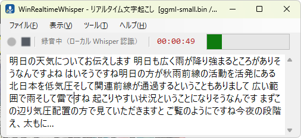

# WinRealtimeWhisper — リアルタイム文字起こし（Windows 11 / .NET Framework 4.8）

[English](README.md) | **日本語**

スピーカー出力（WASAPI ループバック）とマイクの音声を **ローカルの Whisper** で
文字起こしし、結果をリアルタイム表示しながらテキストと WAV に保存する簡易ツールです。

**API キーもネットワークも不要**です。認識はすべて PC 上で完結します。



## モデル

既定は **`ggml-small.bin`（488 MB）** です。設定ダイアログの「モデル」タブで
`tiny` / `base` / `small` / `medium` から選べます。

未取得のモデルを選んだ場合は、起動時または録音開始時に確認ダイアログが出て
自動でダウンロードします（進捗はステータスバーに表示）。
手動で置く場合は次の URL からダウンロードして `%LOCALAPPDATA%\WinRealtimeWhisper\models\`
に保存してください。

<https://huggingface.co/ggerganov/whisper.cpp/resolve/main/ggml-small.bin>

**GPU がない PC では `small` が現実的な上限**です。処理が重い場合は
`base` や `tiny` に落とすと体感が大きく変わります。

## 使い方

1. `WinRealtimeWhisper.exe` を起動します（x64 ビルドです）。
2. 初回はモデルのダウンロード確認が出ます。**はい** を選ぶと取得します。
3. 必要なら **ツール > 設定** で音源とモデルを変えます。
4. **録音開始**（`F5`）を押します。音声を区間ごとに認識し、確定した行が表示されます。
5. **録音停止**（`F6`）を押すと、**残っている音声をすべて認識してから** 確定します。

### メニュー

| メニュー | 項目 | 既定のショートカット |
| --- | --- | --- |
| ファイル | 録音開始 | `F5` |
| ファイル | 録音停止 | `F6` |
| ファイル | 終了 | `Alt+F4` |
| 表示 | 常に最前面 | — |
| ツール | 過去の履歴... | — |
| ツール | 設定... | `Ctrl+,` |
| ヘルプ | ログを開く / ログフォルダを開く / バージョン情報 | — |

### 設定ダイアログ

| タブ | 設定できること |
| --- | --- |
| 全般 | 表示言語（日本語 / English） |
| 録音 | 出力（ループバック）とマイクの取り込み ON/OFF、使うデバイス、**区切りのサイクル**（5 / 10 / 15 / 30 秒）、**無音の区切り**（0.20〜3.00 秒）、**認識する言語**、**GPU（Vulkan）** |
| モデル | 使う ggml モデルとダウンロード |
| 保存先 | テキスト / WAV / モデル / ログの保存先（「参照」で変更できます） |

設定は **OK** を押したときだけ保存されます。
出力と入力のデバイスは別々に指定できます。

**「区切りのサイクル」は認識を何秒ごとに区切るか**です。短いほど表示は速くなりますが、
文脈が減って精度は下がります。既定は 30 秒です。

**「無音の区切り」は、この秒数以上つづく無音で発話を区切る**という長さです
（0.20〜3.00 秒）。短いほど細かく区切られて表示が速くなりますが、
語の途中で切れやすくなります。既定は 0.20 秒です。

**「認識する言語」**は音声の言語です（日本語 / 英語 / 中国語 / 韓国語 / 自動判定）。

**「GPU（Vulkan）を使う」**をオンにすると、Vulkan 対応 GPU があれば GPU で推論します。
GPU が無い・ドライバが古いなどの場合は **自動的に CPU へ切り替わります**。
切り替えたかどうかはログの `backend=` 行で確認できます。
GPU の方が遅い環境ではオフにしてください（次回の録音開始から反映）。
既定は日本語です。表示言語（全般タブ）とは別物です。

**表示 > 常に最前面** を有効にすると、他のウィンドウの後ろに隠れなくなります。
この設定も保存され、次回起動時も維持されます。

表示言語の変更は **次回の起動から** 反映されます。
認識する言語は「録音」タブで変更できます（表示言語とは別物です）。

認識は発話の区切り（「無音の区切り」で設定した長さ、既定 0.20 秒）を待ってから行われるため、
話し終えてから 1〜3 秒ほど遅れて表示されます。
無音が来ない場合も「区切りのサイクル」で設定した長さ（既定 30 秒）で区切ります。

## 保存先

| 種類 | 既定の場所 |
| --- | --- |
| テキスト（履歴） | `ドキュメント\WinRealtimeWhisper\history\session_yyyyMMdd_HHmmss.txt` |
| WAV | `ドキュメント\WinRealtimeWhisper\wav\rec_yyyyMMdd_HHmmss.wav`（`-i` でファイル入力したときは再保存しません） |
| ライブ文字起こし（VTT） | `%LOCALAPPDATA%\WinRealtimeWhisper\transcripts\` |
| モデル | `%LOCALAPPDATA%\WinRealtimeWhisper\models\` |
| ログ | `%LOCALAPPDATA%\WinRealtimeWhisper\logs\` |

どの保存先も **設定 > 保存先** で変更できます。空欄にすると既定に戻ります。

- テキストは録音中も定期的に自動保存され、停止時に確定内容で上書きされます。
- 形式は 1 行 1 発話のプレーンテキストです（時刻は入りません）。
- WAV は 44.1kHz / 16bit / ステレオに正規化して保存します（Whisper へは 16kHz / モノラルで渡します）。
- 履歴は **ツール > 過去の履歴** で見られます。一覧のダブルクリック、
  または「エディタで開く」でテキストファイルを開きます。

## ライブ文字起こし（WebVTT）

録音中、確定した区間は **WebVTT** ファイルへ追記されます。チェックリスト判定や
感情分析、リアルタイム助言などの別プロセスが、このファイルを tail するだけで
API キーなしにリアルタイム解析できます。形式の仕様は
[docs/transcript-vtt.ja.md](docs/transcript-vtt.ja.md)（英語: [docs/transcript-vtt.md](docs/transcript-vtt.md)）にあります。

```
%LOCALAPPDATA%\WinRealtimeWhisper\transcripts\
    2026-09-28_2149.live.vtt   <- 書き込み中。これを tail する
    2026-09-28_2149.vtt        <- 停止時に確定
    current.txt                <- 現在の .live.vtt のファイル名
```

主な特徴:

- **標準 WebVTT。** キューはセッション相対の時刻を持ち、メタ情報は `NOTE` に
  置くため、通常の字幕ツールでも確定後のファイルをそのまま読めます。
- **音源分離による話者ラベル。** ループバック（スピーカーから聞こえる音）は
  `<v Remote>`、マイクは `<v You>` になります。2 系統は混ぜずに別々に認識するため、
  ラベルは正確です。
- **tail しても安全。** 各ブロックは空行で終端されるまで一度に書き込まれるので、
  読み手が書きかけのキューを見ることはありません。
- **生存確認。** 発話が無くても 5 秒ごとに `NOTE heartbeat` を書き、
  正常な停止は `NOTE session_end` で示します。

読み手側の最小実装: `current.txt` を読み、前回の位置までシークし、空行で終わる
ブロックだけを処理し、最後のキュー id を覚えておきます。ポインタの指すファイルが
変わったら、古いファイルを最後まで読み切ってから切り替えます。

**設定 > 保存先** の「ライブ WebVTT 文字起こしを書き出す」と保存先フォルダ、
またはコマンドラインの `--vtt-dir <フォルダ>` / `--no-vtt` で切り替えられます。

## コマンドライン

引数を付けずに起動すると、これまでどおり GUI が開きます。
録音や文字起こしに関わる指定を付けると **GUI を出さずに実行** し、
結果を標準出力へ書き出すのでリダイレクトで保存できます。

```powershell
WinRealtimeWhisper.exe --help
WinRealtimeWhisper.exe --ui-language en --help
WinRealtimeWhisper.exe --list-devices
WinRealtimeWhisper.exe -t 60 -o interview.wav --text interview.txt
WinRealtimeWhisper.exe -t 0
WinRealtimeWhisper.exe -i speech.wav
```

| オプション | 説明 |
| --- | --- |
| `-t`, `--seconds <秒>` | 録音する長さ。`0` で停止操作まで続けます |
| `-i`, `--input <ファイル>` | 文字起こしする音声ファイル（録音デバイスは開きません） |
| `-s`, `--source <both\|speakers\|mic>` | 取り込む音源 |
| `-o`, `--output <ファイル>` | WAV の保存先 |
| `--text <ファイル>` | テキストの保存先 |
| `--vtt-dir <フォルダ>` | ライブ WebVTT 文字起こしの保存先 |
| `--no-vtt` | ライブ WebVTT 文字起こしを書き出さない |
| `-m`, `--model <ファイル名>` | 使う ggml モデル |
| `--model-dir <フォルダ>` | モデルの置き場を差し替える |
| `-l`, `--language <コード>` | 認識する言語（既定 `ja`） |
| `--ui-language <ja\|en>` | 画面と出力の表示言語 |
| `--max-chunk <秒>` / `--silence <秒>` | 区切りの調整 |
| `--output-device <id\|名前>` / `--input-device <id\|名前>` | 使うデバイス |
| `--list-devices` | 使えるデバイスを一覧して終了 |
| `-n`, `--headless` | 強制的に GUI なしで実行 |
| `-h`, `--help` / `--version` | ヘルプ / バージョン |

コンソールへ出すメッセージ（ヘルプ・エラー・進捗・結果）は **既定で英語**です。
日本語にしたいときは `--ui-language ja` を付けてください。
GUI の表示言語はこれまでどおり設定（全般タブ）に従います。

`-i` でファイルを渡した場合は、最後まで読み終えてから残りを認識し、
結果を出力して終了します（WAV への再保存はしません）。

## 仕組み

### 認識の流れ

```
WASAPI（48kHz / 2ch / 32bit float）
  ├─ 出力（ループバック） … settings.OutputDeviceId
  └─ マイク              … settings.InputDeviceId
       └─ SampleConverter        … 16kHz / モノラル / float へ変換
            └─ WhisperRecognizer
                 ├─ 区切りスレッド  … 無音と長さで発話区間を切り出す
                 └─ 推論スレッド    … 区間を Whisper に渡し、確定テキストを通知
                      └─ TranscriptionEngine → MainForm（リアルタイム表示）
```

区切りと推論を別スレッドに分けているのは、CPU 推論が数秒かかる間も
音声を取りこぼさずに溜め続けるためです。

### 区切りの条件

| 条件 | 既定値 | 意味 |
| --- | --- | --- |
| 区間の最小長 | 3 秒 | これ未満では切らない（短いと文脈がなく精度が落ちる） |
| 無音の継続 | 0.8 秒 | この長さの無音で区切る |
| 区間の最大長 | 30 秒 | 無音が来てもいなくてもここで切る（設定の「区切りのサイクル」で変更可） |
| 無音とみなす RMS | 0.0022 | これ未満を無音として扱う |

区間の最大長は表示の遅れに直結します。30 秒だと「発話開始から確定まで」が
最悪 30 秒 + 推論時間になり、無音で切れた場合はそれより早く出ます。
速さを優先したいときは設定で 5 秒などに下げてください。

無音だけの区間は推論せずに捨てます（Whisper は無音に対して
「ご視聴ありがとうございました」等の幻聴を出しやすいため）。

### リアルタイム表示

Whisper はストリーミング認識ではなく区間ごとのバッチ処理なので、
確定した行だけを黒字で積みます。発話の区切りがつくまで表示されません。

## トラブルシューティング

ログはここに出ます。

```
%LOCALAPPDATA%\WinRealtimeWhisper\logs\winrealtimewhisper-yyyyMMdd-HHmmss.log
```

### 音声が届いているか確認する

2 秒ごとに次の行が記録されます。

```
[audio] cb=30 bytes=165120 fmt=48000Hz/2ch/32bit peak=0.4257(-7.4dB) rms=0.0816(-21.8dB) rtf=0.14 chunks=1 dropped=0
```

| 項目 | 意味 |
| --- | --- |
| `cb` | 2 秒間に届いたコールバック回数。`0` ならデバイスが停止している |
| `peak` / `rms` | 最大振幅 / 実効値。`-96dB` は無音 |
| `fmt` | ループバックなら通常 `48000Hz/2ch/32bit` |
| `rtf` | 推論時間 ÷ 音声長。**1 未満なら実時間に追いついている** |
| `chunks` | 認識した区間の数 |
| `dropped` | 推論が追いつかず捨てた区間の数 |

| 症状 | 原因の候補 |
| --- | --- |
| `cb=0` | 録音デバイスが開けていない・停止した |
| `rms` が -50dB 以下 | 音量ゼロ、ミュート、再生中の音が無い |
| `rtf` が 1 を超える | CPU 性能不足。`small` → `base` / `tiny` に落とす |
| `dropped` が増える | 同上 |
| 無音なのに文字が出る | 幻聴。`[whisper]` 行の `text=` を確認する |

### 認識精度が低い

- モデルを上げる（`tiny` → `base` → `small`）
- 音源を確認する。ループバックは PC の再生音のみ拾うため、
  マイク音声は「マイク」または「スピーカー＋マイク」を選ぶ
- 言語設定が音声と一致しているか確認する

## 実装上のポイント

- **16kHz モノラル変換**: Whisper は 16kHz モノラルの float サンプルを要求します。
  ループバックの 48kHz ステレオ float を線形補間でリサンプルし、
  チャンネルは平均してモノラル化します。位相は呼び出しをまたいで保持するため、
  バッファの境界で音が途切れません。
- **区間の切り出し**: 末尾の無音を少し残して切ることで、語尾が欠けるのを防ぎます。
- **重複の回避**: 切り出し済みのサンプルはバッファから取り除き、
  相対時刻は `_baseSamples` で別に数えます。区間の長さはバッファの要素数そのものを正とし、
  別カウンタを持ちません（ずれると区間が永久に切り出されなくなります）。
- **停止処理**: 停止時に区切りスレッドの終了を待ってから残りを推論するため、
  停止直前の発話も取りこぼしません。
- **GPU の選択**: CPU 版と Vulkan 版の両方を同梱し、起動時に優先順位
  （Vulkan → CPU）で読み込みます。Vulkan が使えない環境では自動で CPU の DLL が
  選ばれるため、GPU の有無を自分で判定する必要はありません。どちらが選ばれたかは
  ログの `backend=` 行（`Vulkan` または `Cpu`）に出ます。

## 既知の制限

- 認識は区間単位です。発話中の途中経過は表示されません（確定した文だけが出ます）。
- WAV は音源ごとに別ファイルにはならず、1 セッション 1 ファイルにミックスして保存されます。
- 既定のマイクは「マイク」を選んだときに使用されます。
  「スピーカー＋マイク」ではループバックと既定マイクを同時に開きます。
- 「スピーカー＋マイク」で両方から同じ音が入ると、二重に認識されることがあります。
